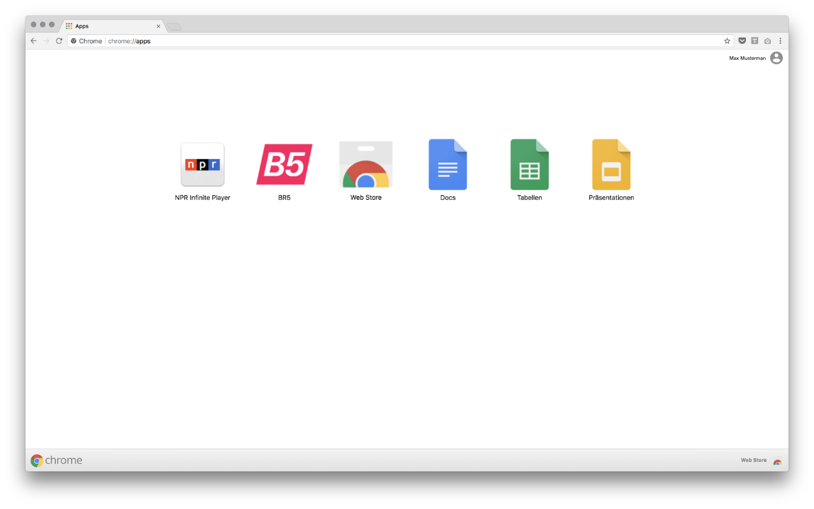
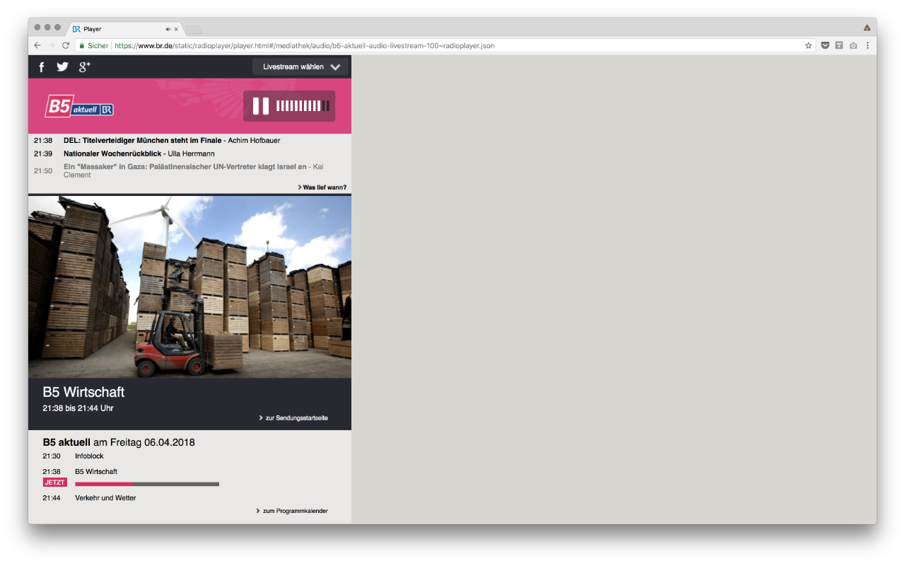

B5
==============

**[Bayern 5 Aktuell](https://www.br.de/static/radioplayer/player.html#/mediathek/audio/b5-aktuell-audio-livestream-100~radioplayer.json) von [Chrome Apps](chrome://apps) aufrufen.**






Installieren
-------------

1.  Wählen Sie ```Erweiterungen``` unter der ```Fenster``` Menü aus oder gehen Sie zu [chrome://extensions](chrome://extensions).

2. Sicherstellen das Kontrollkästchen für ```Entwicklermodus``` oben rechts aktiviert wurde.

3. Klicken Sie auf die Schaltfläche ```Entpackte Erweiterung Laden```.

4. Suchen Sie den ```/src``` Ordner von diesem Repo und laden Sie ihn hoch oder den ```/src``` Ordner direkt auf den geöffneten [chrome://extensions](chrome://extensions) Tab ablegen.
